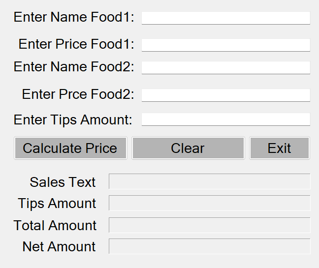
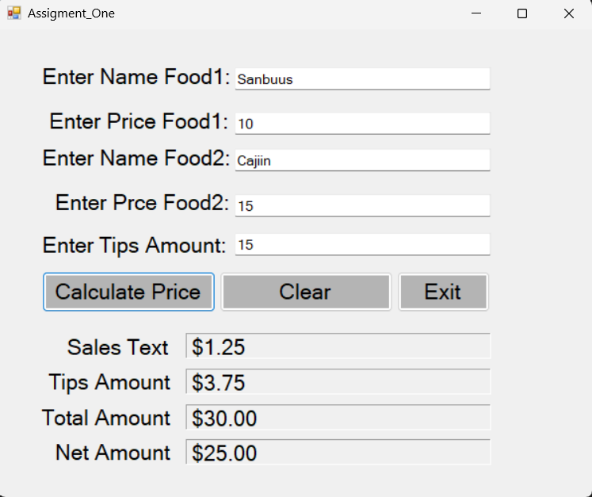

# PRACTICE SCREENSHOT WITH EXPLANATION



> ### Sawirkan waxaan ku practice gareeyay
> - **Label Control**
> - **TextBox Control**
> - **Button Control**
> - **Processing Data** (variables, const, parsing iyo try/catch)

Sawirkan waa Form yar oo xisaabiya biilka cuntada. User-ku wuxuu galinayaa magaca iyo qiimaha laba cunto, iyo boqolkiiba intee tips ah. Marka uu riixo **Calculate Price**, program-ku wuxuu soo bandhigayaa sales tax, tips, total iyo net amount.

# Qeybta 1aad [Controls-ka Form-ka]

Form-ka waxaa ku jira shan qeybood oo kala duwan:

-- ***Labels-ka hore (Enter Name Food1, Enter Price Food1 iwm)***

Shan Label ayaa ka horeeya textbox-kasta, si user-ku u ogaado xogta uu qoraayo. Waxaa jira Food1 iyo Food2, mid walbo magac iyo qiime, ugu dambayn Tips Amount.

-- ***Shanta TextBox***

Kuwaan ayaa iiga soo qaadaya xogta user-ka. Magacyadooda waa `TxtFood1`, `TxtPriceFood1`, `TxtFood2`, `TxtPriceFood2` iyo `TxtTIpsAmount`.

-- ***Saddexda Button***

- **Calculate Price** wuxuu sameeyaa xisaabta
- **Clear** wuxuu tirtiraa wax walba
- **Exit** wuxuu xiraa Form-ka

-- ***Afarta Label ee hoose (Sales Text, Tips Amount, Total Amount, Net Amount)***

Kuwaan waa Label-yo leh border, waana halka natiijada lagu soo bandhigo. Magacyadooda waa `LblSalesText`, `LblTipsAmount`, `LblTotalAmount` iyo `LblNetAmount`.

# Qeybta 2aad [Button-ka Calculate Price]

Button-kaan ayaa ah qeybta ugu muhiimsan, waana kan Syntax-ka:

```
private void Btn_Amount_Click(object sender, EventArgs e)
{
    // creating variables
    String Food1, Food2;
    Double P_Food1, P_Food2, Amount, TotalAmount, SalesTax, Tips, NetAmount;

    // creating const variables
    const double salesTaxRate = 5;
    double tipsRate = int.Parse(TxtTIpsAmount.Text);


    try
    {
        // Taking the data from the User
        Food1 = TxtFood1.Text;
        Food2 = TxtFood2.Text;
        P_Food1 = double.Parse(TxtPriceFood1.Text);
        P_Food2 = double.Parse(TxtPriceFood2.Text);

        // process

        // calculating total amount
        Amount = P_Food1 + P_Food2;

        // calculating the tax amount
        SalesTax = Amount * (salesTaxRate / 100);
        Tips = Amount * (tipsRate / 100);

        // calculating Total Amount for pay
        TotalAmount = Amount + SalesTax + Tips;

        // Calculating the net Amount
        NetAmount = TotalAmount - SalesTax - Tips;

        // Displaying The Amounts
        LblSalesText.Text = SalesTax.ToString("c");
        LblTipsAmount.Text = Tips.ToString("c");
        LblTotalAmount.Text = TotalAmount.ToString("c");
        LblNetAmount.Text = NetAmount.ToString("c");
    }

    catch (Exception)
    {
        MessageBox.Show("Enter Valid Values");
    }
}
```

Waa kan sida code-ka u shaqeeyo:

**Variables.** Magacyada cuntada waxaan ku kaydiyay `String`, qiimayaasha iyo xisaabaadka kalena `Double`, sababtoo ah qiimaha cuntada wuxuu noqon karaa decimal.

**Const.** `salesTaxRate` waxaan ka dhigay `const` maxaa yeelay qiimihiisu ma isbeddelo. 5 waxaa loola jeedaa 5%, taasoo markaan xisaabinayo loo qaybiyo 100.

**Parsing.** TextBox-ku had iyo jeer wuxuu bixiyaa `string`, sidaas darteed `double.Parse()` ayaan u isticmaalay inaan qiimaha u beddelo lambar.

**Xisaabta.** Marka hore waxaan isku daray labada qiime si aan u helo `Amount`. Kadib `SalesTax` iyo `Tips` waxaa laga xisaabiyay boqolkiiba Amount-ka. `TotalAmount` waa Amount, tax iyo tips oo la isku daray.

**Net Amount.** Waxaan ka jaray tax-ka iyo tips-ka wadarta, si aan u aqoonsado qiimaha cuntada kaliya.

**ToString("c").** Wuxuu number-ka u beddelaa qaab lacag (currency), tusaale `$34.50`. Calaamadda lacagta waxay ku xirantahay Region settings-ka kombuyuutarka.

**Try/Catch.** Haddii user-ku qoro xarfo ama uu banaan ka tago textbox-ka, program-ku ma burburo. Halkii, wuxuu soo bandhigayaa MessageBox "Enter Valid Values".

> **TUSAALE**
>
> Food1 = 10, Food2 = 20, Tips = 10
>
> Amount = 30, Sales Tax = $1.50, Tips = $3.00, Total = $34.50, Net = $30.00

> **Fiiro gaar ah**
> - `tipsRate` waxay ku jirtaa **dibadda** try-ga, markaa haddii Tips banaan yahay ama decimal yahay (tusaale 7.5), program-ku wuu burburayaa, MessageBox-na ma soo baxayo. Waa fiican tahay in la geliyo gudaha try-ga, ama la beddelo `double.Parse`.
> - `Food1` iyo `Food2` waa la akhriyay balse xisaabta kuma jiraan, waxaa la isticmaali karaa haddii biil dhammeystiran la daabaco.

# Qeybta 3aad [Button-ka Clear]

Button-kaan wuxuu nadiifiyaa textbox-yada iyo label-yada. Halkaan waxaan ku isticmaalay saddexda hab ee wax loo tirtiro, si aan u practice gareeyo:

```
private void BtnClear_Click(object sender, EventArgs e)
{
    // clearing the text boxes
    TxtFood1.Clear();
    TxtFood2.Text = "";
    TxtPriceFood1.Text = String.Empty;
    TxtPriceFood2.Clear();
    TxtTIpsAmount.Clear();

    // clearing the labels
    LblSalesText.Text = String.Empty;
    LblTipsAmount.Text = String.Empty;
    LblTotalAmount.Text = String.Empty;
    LblNetAmount.Text = String.Empty;
}
```

- `Clear()` waa function-ka TextBox-ka
- `""` waa empty string
- `String.Empty` waa property-ga class-ka String

Saddexduba isku shaqo ayey leeyihiin. `Clear()` wuxuu ka shaqeeyaa TextBox kaliya, Label-ku Clear() ma lahan, sidaas darteed Label-yada waxaan ku tirtiray `String.Empty`.

# Qeybta 4aad [Button-ka Exit]

Button-kaan wuxuu xiraa Form-ka.

```
private void BtnExit_Click(object sender, EventArgs e)
{
    // Closing the form
    this.Close();
}
```

> THIS IS THE RESULT


