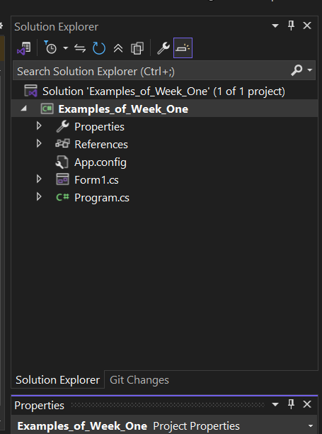
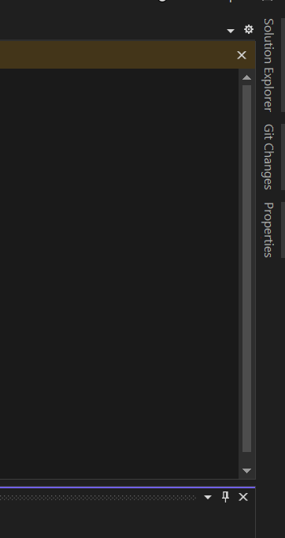
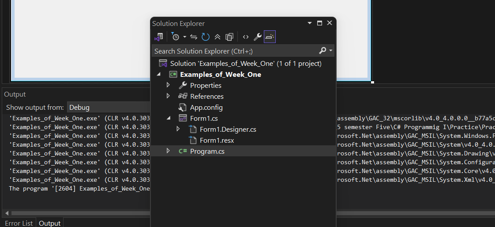
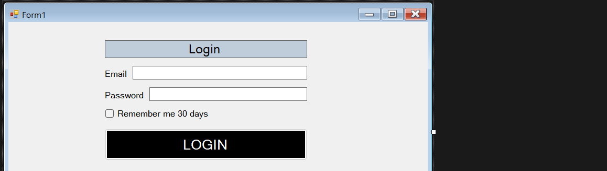
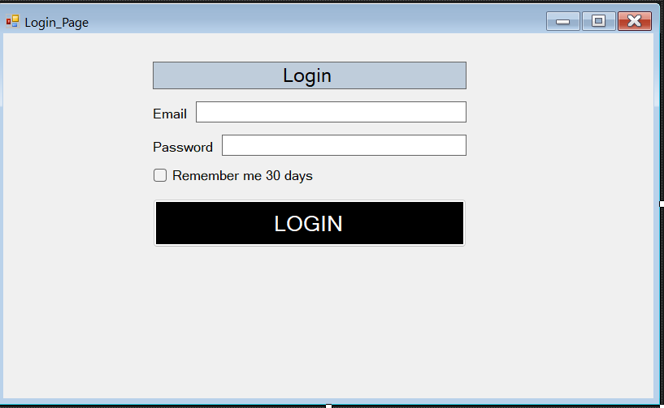
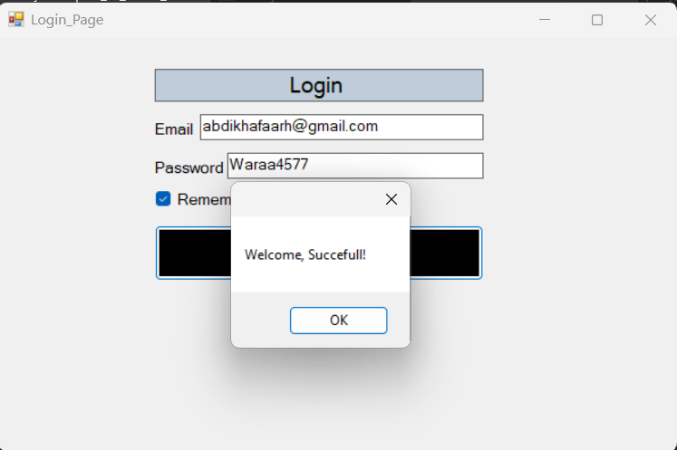
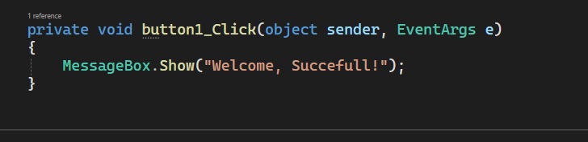

# Practice Screenshot With Explanation

### Example 1: Auto Hide Mode

<table>
  <tr>
    <th align="center">Auto Hide Before</th>
    <th align="center">Auto Hide After</th>
  </tr>
  <tr>
    <td align="center">
      
    </td>
    <td align="center">
      
    </td>
  </tr>
</table>

This screenshot shows the **Auto Hide** feature in Visual Studio.

Auto Hide helps hide tool windows when you are not using them. This gives you more space to write and view your code.

The **pin icon** controls Auto Hide. When the window is unpinned, it hides automatically. When it is pinned, it stays open.

### Example 2: Floating Windows

This screenshot shows a **floating windows** layout in Visual Studio.

Floating windows are tool panels that are not attached to the main edges of the IDE. Instead, they can move freely inside the workspace, making it easier to arrange tools in a custom layout that fits the developer's workflow.

In this example, the windows are not pinned to the side of the screen, so they appear as separate panels that can be dragged and positioned anywhere. This gives more flexibility when working with multiple tools at the same time.

Floating windows are useful when you want more control over the arrangement of your workspace and prefer a more personalized layout while coding.

### Example 3: Some of Form Controls

This screenshot shows some important **Windows Forms controls** used in C# programming.

In the form, you can see different controls such as a **TextBox**, **Button**, and other visual elements that help the user interact with the application. These controls are used to collect input, display information, and trigger actions when the user clicks or types.

### Example 4: Event (MessageBox.Show)

<table>
  <tr>
    <th align="center">Before Clicking</th>
    <th align="center">After Clicked</th>
  </tr>
  <tr>
    <td align="center">
      
    </td>
    <td align="center">
      
    </td>
  </tr>
</table>

This screenshot shows an **event in C#** using `MessageBox.Show()`.

Before clicking the button, the form is waiting for the user to interact with it. After the button is clicked, a message box appears on the screen with a success message such as **"Welcome, Successful!"**. This confirms that the button click event has been triggered correctly.

Events are very important in C# because they allow the program to respond to user actions such as clicking a button, typing text, or selecting an item. The `MessageBox.Show()` method is a simple way to display information or notify the user about the result of an action.

---
#### I used this code to make The Event

