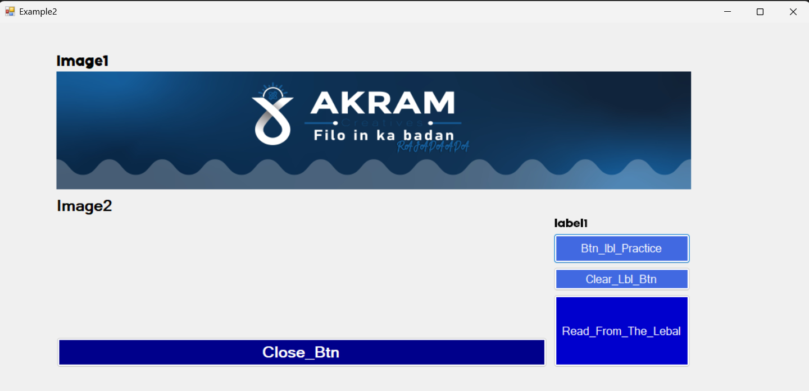
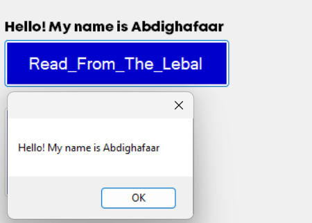
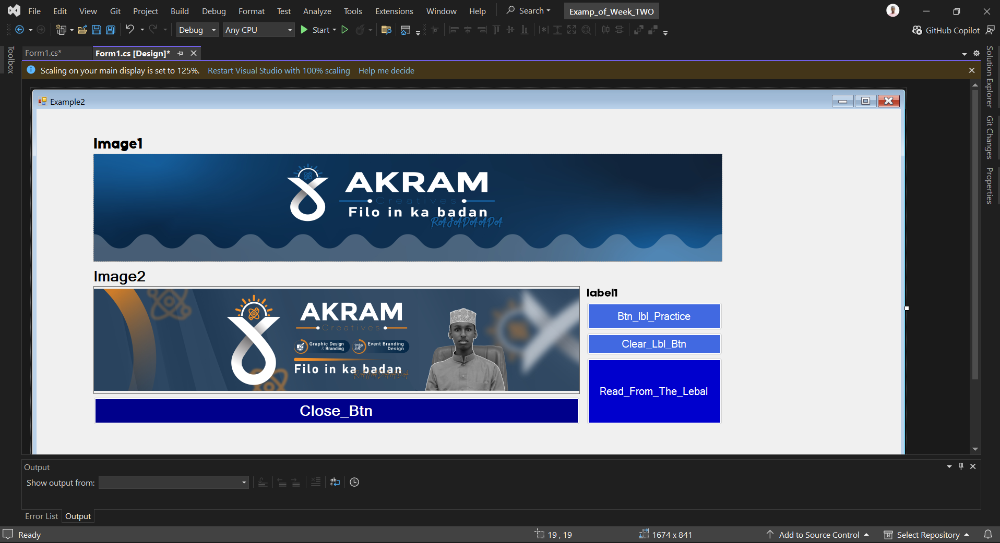
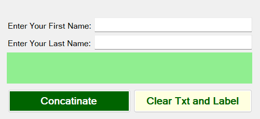
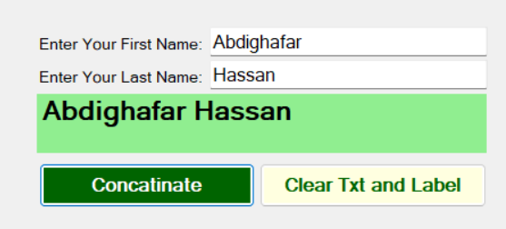

# PRACTICE SCREENSHOT WITH EXPLANATION



> ### Sida aad arki karto sawirkaan waxaan ku practice gareeyay controls ay ka mid yihiin
> 1. **PictureBox Control**
> 2. **Label Control**
>

# Qeybta 1aad [PictureBox Control]
Waxaa sameestay Laba **PictureBox** Mid walbo waxaan ku practice gareeyay qeybo gooni ah 

-- ***Sawrika koowaad (Image1)***

Sawirkaas waxaan u isticmaaalay si aan usoo galiyo **Local Resource** sidoo kale **sizeMode** propety waxaa ka dhigay *StretchImage* kaliya waan ku practice gareenaaye lee lkn *stretchImage* waxa uu dhibaato u geestaa tayada Sawirka.

-- ***Sawirka Labaad (Image2)***

Sawirkaas waxaan u isticmaaalay si aan usoo galiyo **Project Resourcen File** sidoo kale **sizeMode** propety waxaa ka dhigay *Autosize* Sidoo kalene Porpety-ga **Visible** waxaa ka dhigay *FALSE* taas ka dhigay in markii form-ka la run gareeyo aan sawirka la arkin


> Waakan qaabka u noqonaa marka **Visible-giisa** Yahay *TRUE*

# Qeybta 2aad [Label Control]
Qeybtaan waxaa ku practice-gareeyay label, So Marka si aan u sameeya waxyaabo badan oo label la xiriira waxaan sameestay Buttons kuwaas oo iga caawinaayo inaa user-interactive sameeyo

-- ***Button-ka Kooowaad***

Button-kaan waxaan u isticmaalay inaa labelka wax ku shubo anigoo isticmaalaayo **C# Code** Waana kan Syntax aan qoray:

```
private void button1_Click(object sender, EventArgs e)
{
    // set lebel
    Lbl_Name.Text = "Hello! My name is Abdighafaar";

}
```

> **THE RESULT**


-- ***Button-ka Labaad***

Button-kaan waxaan u isticmaalay inaa ku tirtiro waxaan label ku qoray waxaan isticmaalay **C# Code** Waana kan Syntax aan qoray:

```
private void button2_Click(object sender, EventArgs e)
{
    // this clear my Lbl_Name you can make two ways
    // First way: using empty property
    Lbl_Name.Text = String.Empty;

    // Second way: using empty string
    Lbl_Name.Text = "";

}
```
> **THE RESULT**


-- ***Button-ka Saddexaad***

Button-kaan waxaa uu soo aqrinaa waxaan label-ka ku shubay waxaana isticmaalaayo **C# Code** Waana kan Syntax aan qoray:

```
private void BtnReader_Click(object sender, EventArgs e)
{
    // Read From the lebal 
    String Name = Lbl_Name.Text;
    MessageBox.Show(Name);
}
```

> **THE RESULT**



-- ***Buttonka Afaraad***

Button-kaan waxaa uu Xeraa Formka Run Gareesan waxaana isticmaalaayo **C# Code** Waana kan Syntax aan qoray:

```
private void button3_Click(object sender, EventArgs e)
{
    // this closes the application you can make also two ways 
    // First way: using close function
    this.Close();

    // Second way: using Exit function
    Application.Exit();
}
```
> **THE RESULT**



---

---



> ### Sidoo kale sawirkaan waxaan ku practice gareeyay
>
> - **Textbox Control**
> - **Processing Data**

# Qeybta 1aad [Textbox Control]

Waxaa sameestay Laba **Textbox** Kuwaas oo iiga soo qaadaayo user-ka Data, Waxaan ka hormariyay textbox-kasta Label Kaas oo userka u cadeenaayo xogta uu soo galinaayo

# Qeybta 2aad [Processing Data]

Qeybtaa **60%** ku Practice-gareeyay **_Variables_** Like Declearing, Initializing, intaas ka dibna waan soo daabacaayay, sidoo waxaan sameeyay Concatination button kaas oo isku xiraay user xogta oo soo galiyay oo ahayd firstname and lastname Waana kan Syntax:

```
private void ConcatBtn_Click(object sender, EventArgs e)
{
    // creating variables
    string Firstname, Lastname;

    // initialize the variables
    Firstname = FirstnameTxtBx.Text;
    Lastname = LastnameTxtBx.Text;

    // concartinating the name
    string Fullname = Firstname + " " +Lastname;

    // printing the full name
    LblOutput.Text = Fullname;
}
```

> **THE RESULT**



---

Isla qeybta waxaan ku practice-gareeyay ***Clearing TextBox*** anigoo isticmaalaayo the three ways of clearing *ClearFunction, Empty string, Empty Property taas ku jirto classka String-ga* waanakan syntax:

```
private void ClearTxt_Click(object sender, EventArgs e)
{
    // you can clear TextBox three ways
    // First: is using Clear Function 
    FirstnameTxtBx.Clear();

    // Second & third: is just like the two ways of label 
    LastnameTxtBx.Text = string.Empty;

    // don't confuse this is clearing the label 
    LblOutput.Text = String.Empty;

}
```

> **THE RESULT**


